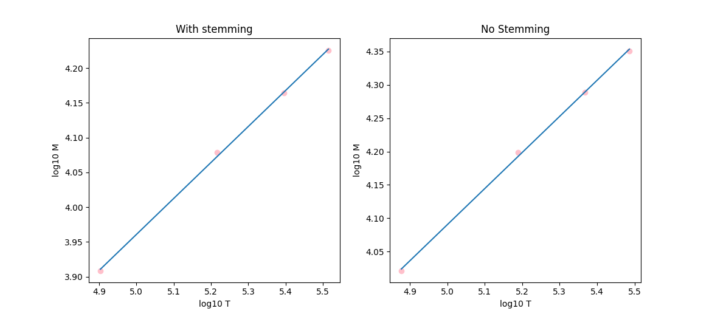
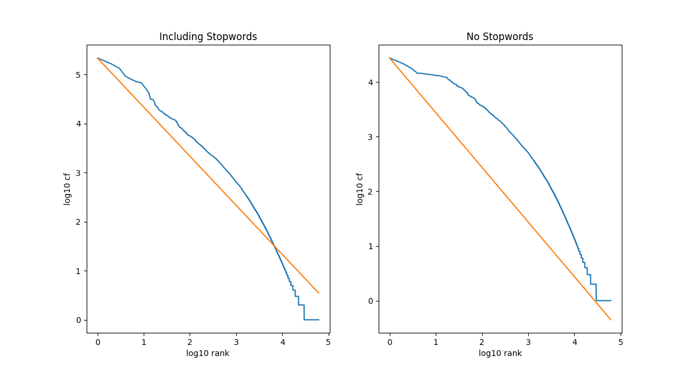

# News-Search-Engine
This project is an information retrieval system that indexes, retrieves, and ranks the news in the dataset. 
Heap's and Zipf's laws are also implemented and the correctness of them are checked with multiple conditions.
## The Heap's Law
The Heap's law predictions with and without stemming can be compared according to the results below.

  

  

## The Zipf's Law
The Zipf's law predictions with and without considering the stopwords can be compared according to the results below.

  

